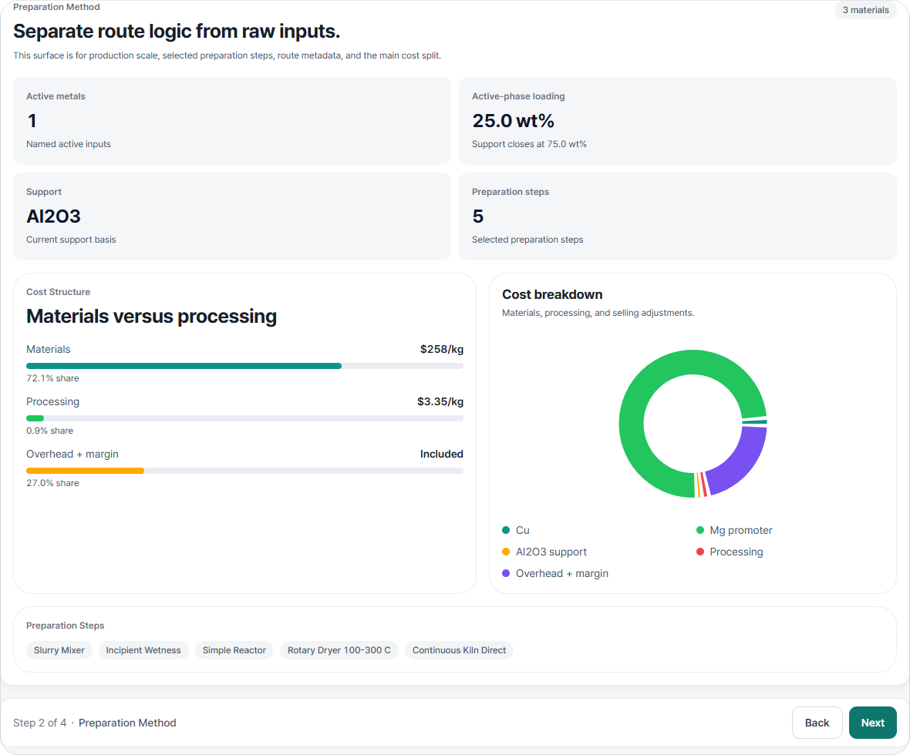

<p align="center">
  
</p>

<p align="center">
  <strong>Estimate what a catalyst costs to make, using live metal prices.</strong>
</p>

<p align="center">
  <a href="https://github.com/hyunjin-kor/COMET/releases/latest"></a>
  
  <a href="https://doi.org/10.5281/zenodo.21451931"></a>
  
</p>

<p align="center">
  <a href="https://github.com/hyunjin-kor/COMET/releases/latest"><b>Download</b></a> ·
  <a href="#what-it-does">What it does</a> ·
  <a href="#screens">Screens</a> ·
  <a href="#method-basis">Method basis</a> ·
  <a href="docs/roadmap.md">Roadmap</a>
</p>

**COMET** estimates what a catalyst costs to make. Describe the composition, the
support and the preparation route, and it prices that recipe against current metal
quotes using the published CatCost method. It runs entirely on your machine. No
server, no account.

Built for catalysis researchers with questions like:

- If platinum moves 20%, what does that do to my cost?
- Is the metal driving this number, or the preparation route?
- How does my composition compare to published catalysts for the same reaction?

## Download

Get the installer from the [latest release](https://github.com/hyunjin-kor/COMET/releases/latest):

- `COMET.Setup.<version>.exe` for most people
- `COMET-win-unpacked.zip` if you want a portable copy

It works offline. Without API keys it falls back to indexed and manual prices.

Since v1.3.13 the app updates itself: it checks GitHub Releases at startup,
downloads in the background, and prompts you to restart. The binary is unsigned,
so SmartScreen will warn you the first time. Pick "More info → Run anyway".

## What it does

- Costs the preparation route with the Step Method, following the CatCost methodology published by NREL
- Tags every price `LIVE`, `INDEXED` or `MANUAL`, and shows the source, quote year and freshness behind it
- Switches between a practical basis (live quotes) and an academic basis (IMF and Johnson Matthey monthly averages), so a screening result can be quoted against a citable month
- Ships thirty literature benchmark families you can load and edit: ammonia cracking, CO₂ hydrogenation, RWGS, dry reforming, water-gas shift, fuel-cell ORR, electrolyzer OER and more
- Covers bulk supported catalysts as well as electrode-stack electrocatalysts
- Runs Monte Carlo, so you get a range rather than one number
- Credits spent-catalyst recovery on thermocatalyst runs, if you want it
- Escalates older prices to this year with ChemPPI and CEPCI
- Exports the cost ledger, price evidence and Monte Carlo range to CSV

## How a session goes

Pick thermocatalyst or electrocatalyst, define the composition, choose a
preparation route, run it. The result opens on its own screen with the full cost
ledger and the evidence behind each price. Tweak the recipe and rerun; the draft
stays put.

The Prices page tracks every metal with its quote basis and history. The
Benchmarks page lines up published routes for a reaction family, and loads any of
them into the calculator.

## Screens



Composition input, preparation routes, live metal prices, benchmark comparison,
the Monte Carlo range and the source library are in [docs/screens.md](docs/screens.md).

## Building from source

Requires Python 3.11+, Node.js 18+, and Windows for desktop packaging.

```bash
npm install
npm run dev      # development: Electron shell + FastAPI sidecar + Vite renderer
npm run web      # browser mode: build the frontend, then serve the whole app at http://localhost:8765
npm run build    # packaged installer under dist-electron\
```

The build produces `dist-electron\COMET Setup <version>.exe` and an unpacked app
at `dist-electron\win-unpacked\COMET.exe`. Running instances are stopped
automatically before a rebuild, or manually with `npm run desktop:stop`.

## Tests

The prepared source version is **1.4.0**; the latest verified public release is **v1.3.24** (2026-09-06). Tagging and publishing 1.4.0 remain human release steps. See the [release preparation checklist](docs/release-checklist.md) and [Korean getting-started guide](docs/getting-started.ko.md).

```bash
python -m pytest backend/tests -q    # engine + API, includes CatCost validation cases
cd frontend && npm run build         # type-check + build
npm run smoke:desktop                # packaged-app smoke test
```

The engine reproduces the three published CatCost reference cases (2 wt% Pt/C,
21 wt% Ni/Al₂O₃, USY-based FCC; User Guide Table 6.2) line by line from the
published inputs. Pt/C matches to the cent. The other two land within 7%, and
both residuals trace to footnotes in the table itself.
`scripts/reproduce_catcost_table62.py` prints the full comparison.

## Reproduce the paper

Reproduce the paper's monthly reference basis, analyses and figures with:

```bash
python scripts/reproduce_paper.py --price-basis reference --month 2026-07 --seed 20260906
```

Omit `--month` for the latest common completed publication month. Matplotlib is needed for figures. To replay exactly from committed inputs, add `--history docs/paper/price_history_2026-09-06.json --live-basis docs/paper/live_basis_2026-09-06.json`. Input hashes, source failures and Python/package versions are recorded in the reproduction manifest. See [methodology](docs/methodology.md#reproducing-the-paper) and the [run audit](docs/audit/autonomous-run-2026-09-06.md).

## Optional API keys

COMET runs without any keys. Add them only if you want live price feeds:

```env
METALS_DEV_API_KEY=your_key      # metals.dev, free tier available
METALPRICE_API_KEY=your_key      # metalpriceapi.com, free tier available
BLS_API_KEY=your_key             # bls.gov, free with registration
COMTRADE_API_KEY=your_key        # comtradeplus.un.org, free tier; monthly support-material unit values on the academic basis
```

## Method basis

COMET is an independent implementation. It cites the CatCost methodology
academically but does not redistribute CatCost source data, and it is not
affiliated with or endorsed by NREL.

- Baddour, F. G., et al. (2018). Estimating Precommercial Heterogeneous Catalyst Price: A Simple Step-Based Method. *Organic Process Research & Development*. [Verified DOI](https://doi.org/10.1021/acs.oprd.8b00245).
- Van Allsburg, K. M., et al. (2022). Early-stage evaluation of catalyst manufacturing cost and environmental impact using CatCost. *Nature Catalysis*.

Benchmark- and route-specific references are attached to the datasets inside the app.

To cite COMET itself, use the Zenodo DOI
[10.5281/zenodo.21451931](https://doi.org/10.5281/zenodo.21451931) or GitHub's
"Cite this repository" button.

## The name

A comet nucleus is a pitted, porous sphere, which is roughly what a catalyst
pellet looks like. The acronym came afterwards.

## License

[PolyForm Noncommercial License 1.0.0](LICENSE) (`PolyForm-Noncommercial-1.0.0`).

Free to use, modify and redistribute for any noncommercial purpose: research,
education, personal study. Use by universities, public research organizations and
government institutions is permitted regardless of funding source. Commercial use
requires a separate license from the copyright holder.
