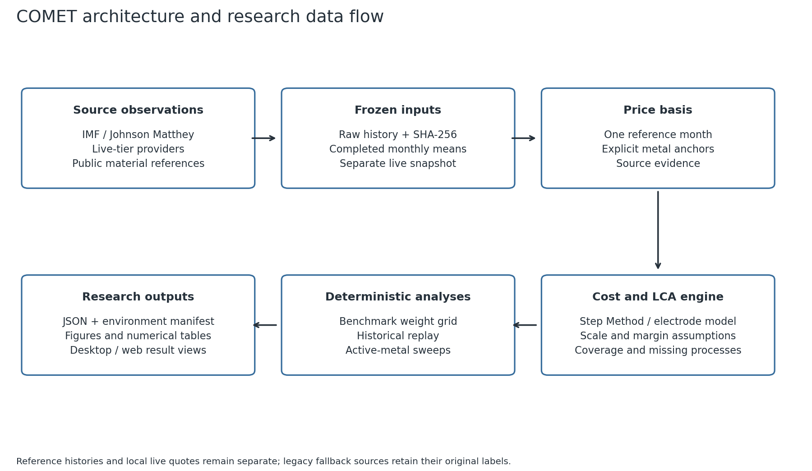
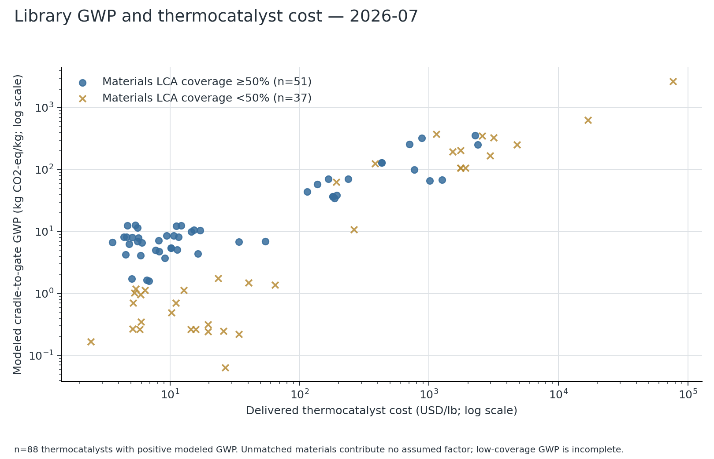
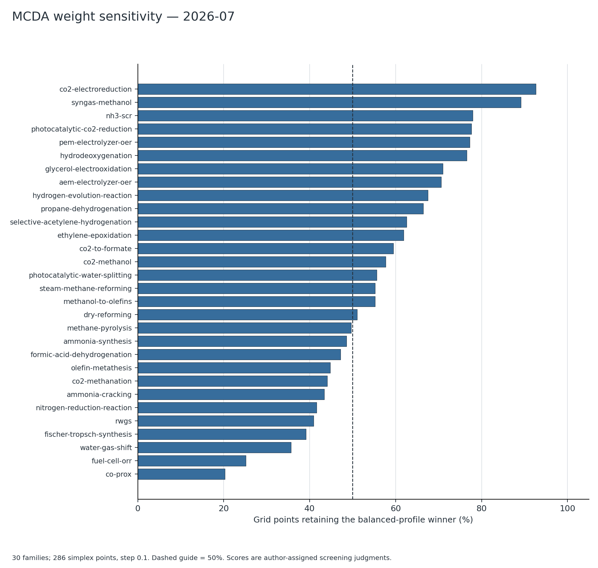
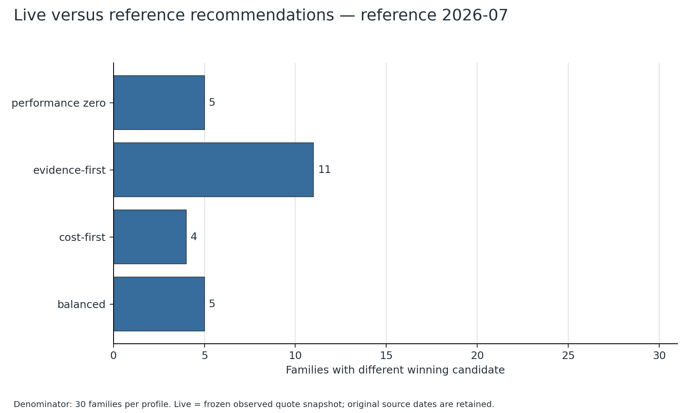
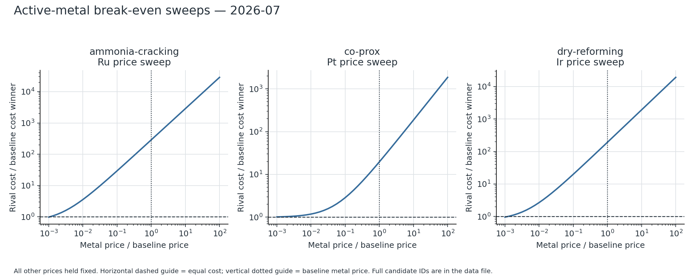

# Route-resolved catalyst manufacturing costs and environmental screening across published metal-price states

## Abstract

Catalyst screening recommendations depend on preparation assumptions, environmental coverage and the metal-price basis. We present COMET, an independent desktop implementation of published Step Method costing with source-linked prices, route-energy accounting and reproducible ranking analysis. Published CatCost validation cases are reproduced without fitting their material inputs; platinum on carbon matches to the cent. The regenerated library contains 116 candidates across 30 reaction families. <!-- paper_summary_2026-09-06.json:candidates,families --> Among eligible candidates, modelled preparation energy contributes a median 2.45% of reported cradle-to-gate global warming potential. <!-- paper_summary_2026-09-06.json:lca.route_share_median_pct --> Weight sensitivity remains substantial: the balanced winner retains first place on a median 55.4% of the weight grid. <!-- paper_summary_2026-09-06.json:weight_sensitivity.median_balanced_winner_share_pct --> Replaying 91 institutional monthly price states changes the performance-free composite recommendation in six families. <!-- paper_summary_2026-09-06.json:volatility.window.states,volatility.families_flipping_performance_zero --> Distinguishing-metal sweeps separate cost crossings from composite-score crossings, while manufacturing-method comparisons expose scale and uncosted-operation assumptions. The results support publishing the price month, weighting profile and model coverage alongside a recommendation. They do not establish catalyst performance or complete environmental superiority. Frozen inputs, cryptographic hashes and a single reproduction command make each reported result inspectable.

Keywords: catalyst manufacturing; techno-economic analysis; price sensitivity; reproducibility; life cycle assessment; multicriteria screening.

Author names, order, affiliations, corresponding-author details and funding are to be supplied by the authors before submission. No authorship or funding information has been inferred. This working Markdown retains section numbers for review; the ACS submission copy should omit visible numbering.

## 1. Introduction

Early catalyst selection connects composition and preparation to quantities that are rarely measured on the same basis: manufacturing cost, catalytic performance and environmental impact. A literature catalyst formulation describes a route and loading, but its commercial cost also depends on production scale, material procurement and the metal market. An economically attractive candidate at one price basis need not remain attractive at another. Conversely, a changing composite recommendation does not necessarily imply that the lowest-cost candidate changed.

The Step Method developed by Baddour and colleagues estimates precommercial catalyst prices from materials and unit operations.<sup>1</sup> The subsequent CatCost work extended the assessment of catalyst manufacturing cost and environmental impact.<sup>2</sup> COMET independently implements this published methodology; it does not claim ownership of CatCost, distribute its original workbook, or imply endorsement by NREL. Broader uncertainty-aware process tools such as BioSTEAM establish relevant prior art.<sup>3</sup> The contribution examined here is the integration of traceable catalyst price inputs, explicit preparation routes and repeatable screening comparisons, rather than a claim to the first combined cost-and-environmental model.

We ask how much a library recommendation depends on the chosen weights and published metal-price state, and how this differs from the price at which competing catalysts have equal manufacturing cost. A companion manufacturing-method audit makes the production-scale and omitted-operation assumptions visible. The analysis is a screening study of representative formulations, not a validation of commercial procurement prices or measured catalytic activity.

## 2. Methods

### 2.1 Manufacturing cost and workflow scope

COMET evaluates component prices, preparation-step costs, general and administrative overhead, sales/administration/research-and-development uplift and the published selling-margin correlation. The API retains the selected method identifier and repeated unit operations. Scale fitting substitutes the appropriate listed batch or continuous equipment; it does not infer a new rate for missing equipment. Thermal catalysts use mass-based manufacturing costs. Electrode assemblies use catalyst powder, ionomer, membrane and substrate quantities per active area; their area-cost ledger is kept separate from the thermal Step Method ledger. A separately labelled powder cost can still inform procurement interpretation.

The implementation is a local React/TypeScript interface with an Electron shell and a FastAPI/SQLite calculation service. Figure 1 shows how source observations, resolved inputs and model outputs are connected. Public source fields and warnings remain attached to the result. The model boundary is declared per output: sharing a preparation route does not make an incomplete materials LCA equivalent to a complete electrode assembly inventory.



### 2.2 Frozen reference and live price bases

The reference state is July 2026, the latest common completed publication month in the fetched institutional history. <!-- paper_summary_2026-09-06.json:basis_month --> IMF Primary Commodity Price System monthly observations cover Al, Cu, Ni, Zn, Sn, Co, Mo, Au and Ag. Johnson Matthey daily base prices are aggregated to monthly averages for Pt, Pd, Rh, Ru and Ir. The original upstream labels and timestamps are retained. Metals without an institutional series keep their declared USGS or historical anchors; the anchors are not treated as observed monthly volatility.

The separate live comparison freezes the new source-priority policy: Johnson Matthey precedes Yahoo for Pt/Pd and Westmetall precedes Yahoo for Cu/Al. It is an observed collection snapshot with retained source times, not a simultaneous exchange settlement. It must not be interpreted as a substitute for the reference month. Optional Comtrade support prices are all-grade trade unit values. No Comtrade support observations were available in the frozen reference map, so its support prices remain the original library values. Explicit support-series links affect future calculations only when a matching reference quote exists.

### 2.3 Method reproduction and environmental accounting

The CatCost User Guide validation uses the published materials totals, step multiplicities and order sizes. No input is adjusted to reproduce a target total. The FCC effective throughput follows the table's footnote-b rate of 67 short tons/day. <!-- paper_summary_2026-09-06.json:table62[2].effective_rate_ton_per_day --> Residuals are reported against the published values and separated from assumptions in new catalyst cases.

Materials GWP and cumulative energy demand are weighted from the Nuss–Eckelman metal factors.<sup>4</sup> Oxide mappings remain explicit approximations. Carbon, silica, zeolite and other unmatched materials retain a reported mass gap; they are not assigned invented factors. Preparation energy is computed only for modelled operations from the same route. Solvent supply, wastewater, equipment manufacture and unmodelled electrode coating energy are outside the reported inventory. Low-coverage totals are incomplete modelled contributions and cannot establish overall environmental superiority.

### 2.4 Ranking and sensitivity analysis

Each family is evaluated with balanced, cost-first and evidence-first profiles, plus a composite with performance weight removed. The performance-free composite retains evidence and route judgements; it is not a ranking on measured cost alone. The weight analysis enumerates a grid of 286 combinations. <!-- paper_summary_2026-09-06.json:weight_sensitivity.grid_points --> Equal composite scores resolve by lower mass-based catalyst cost (USD/lb) and then candidate slug. The candidate set and other source inputs remain fixed when metal prices change.

The monthly replay spans January 2019 through July 2026 and contains 91 common states. <!-- paper_summary_2026-09-06.json:volatility.window.first,volatility.window.last,volatility.window.states --> It varies the series-covered metals together by calendar month, preserving observed co-movement. Break-even analysis instead changes one distinguishing metal while holding other prices fixed. It locates cost and composite crossings separately. A missing crossing means none was found within the recorded sweep range; it is not a proof of dominance at every possible price.

The uncertainty API accepts an optional random seed. The paper command records seed 20260906; its three primary analyses enumerate candidates, weights and price states deterministically rather than estimating these findings by Monte Carlo. <!-- reproduction_manifest_2026-09-06.json:seed,seed_scope --> Default Monte Carlo bounds are scenario assumptions, not confidence intervals fitted from the historical record.

## 3. Results and discussion

### 3.1 Reproduction of the published Step Method cases

| Published case | COMET (USD/lb) | Published (USD/lb) | Residual |
|---|---:|---:|---:|
| Pt/C | 27.3695 <!-- paper_summary_2026-09-06.json:table62[0].comet_usd_per_lb --> | 27.37 <!-- paper_summary_2026-09-06.json:table62[0].published_usd_per_lb --> | −0.00183% <!-- paper_summary_2026-09-06.json:table62[0].residual_pct --> |
| Ni/Al2O3 | 19.2206 <!-- paper_summary_2026-09-06.json:table62[1].comet_usd_per_lb --> | 20.59 <!-- paper_summary_2026-09-06.json:table62[1].published_usd_per_lb --> | −6.65% <!-- paper_summary_2026-09-06.json:table62[1].residual_pct --> |
| USY-FCC, effective-throughput case | 2.4380 <!-- paper_summary_2026-09-06.json:table62[2].comet_usd_per_lb --> | 2.41 <!-- paper_summary_2026-09-06.json:table62[2].published_usd_per_lb --> | +1.16% <!-- paper_summary_2026-09-06.json:table62[2].residual_pct --> |

Pt/C rounds to the published cent. The Ni residual reflects the difference between the table's footnote margin treatment and the published size correlation. FCC requires the effective throughput recorded with the case. These checks establish reproduction of the published calculation with declared inputs; they do not establish predictive accuracy for a new formulation or an uncosted operation. The full intermediate ledger is supplied with the results.


### 3.2 Modelled route energy is usually smaller than the materials term

Among the 54 candidates with at least half their materials mass covered, a modelled process contribution and positive reported GWP, preparation energy contributes a median 2.45% of reported GWP; its upper-decile value is 5.55% and maximum 15.19%. <!-- paper_summary_2026-09-06.json:lca.route_share_eligible_candidates,lca.route_share_median_pct,lca.route_share_p90_pct,lca.route_share_max_pct --> This finding is conditional on the materials coverage and available operation models. It supports inspecting the raw-material term first in those covered cases, but cannot be transferred to carbon- or zeolite-rich candidates whose dominant support contribution is absent.

Across the full library, mean materials coverage is 62.79%, while median coverage is 99.83%; 47 candidates have less than half their materials mass covered. <!-- paper_summary_2026-09-06.json:lca.coverage_mean_pct,lca.coverage_median_pct,lca.candidates_coverage_below_50_pct --> The mean and median difference reflects a divided library rather than uniformly moderate completeness. Figure 3 separates low-coverage points visibly and restricts the cost comparison to mass-based thermal candidates. The figure should not be read as a complete environmental Pareto frontier.



### 3.3 Weighting changes the interpretation of a recommendation

The balanced-profile winner remains first on a median 55.4% of the weight grid. The corresponding minimum and maximum are 20.3% and 92.7%, and 12 families retain the winner on fewer than half the grid points. <!-- paper_summary_2026-09-06.json:weight_sensitivity.median_balanced_winner_share_pct,weight_sensitivity.min_balanced_winner_share_pct,weight_sensitivity.max_balanced_winner_share_pct,weight_sensitivity.families_below_50_pct --> Removing performance weight changes the reference-state winner in three families. <!-- paper_summary_2026-09-06.json:weight_sensitivity.performance_zero_changes --> These are statements about sensitivity to declared decision preferences. The library's performance, readiness and evidence judgements are screening inputs; their scores are not experimentally estimated utilities.



### 3.4 Recommendations depend on the historical state and the selected price tier

Over the full monthly record, the performance-free composite changes winner in six families; the balanced composite changes winner in seven. <!-- paper_summary_2026-09-06.json:volatility.families_flipping_performance_zero,volatility.families_flipping_balanced --> The performance-free changes occur in ammonia cracking, ammonia synthesis, carbon-dioxide-to-formate conversion, CO preferential oxidation, nitrogen reduction and photocatalytic water splitting. <!-- paper_summary_2026-09-06.json:volatility.flipping_families_performance_zero --> Each family's monthly winner sequence is supplied. A change indicates that the fixed screening model responds to observed price states; it does not demonstrate a change in the catalyst's activity, durability or commercial availability.

The frozen live-versus-reference comparison answers a different question. Changing only the price tier changes first-place selection in five balanced-profile families, four cost-first families, eleven evidence-first families and five performance-free families. <!-- paper_summary_2026-09-06.json:live_reference_comparison.changed_by_profile.balanced,live_reference_comparison.changed_by_profile.cost-first,live_reference_comparison.changed_by_profile.evidence-first,live_reference_comparison.changed_by_profile.performance_zero --> The evidence-first result also reflects source-evidence scoring when a monthly institutional reference replaces a live source. Consequently these differences cannot all be attributed to nominal metal-price movement alone. Figure 5 reports the profiles separately; the exact source labels and times permit inspection of that distinction.



The appropriate reporting practice is therefore to name the candidate together with the price basis, month or collection time, weighting profile and relevant coverage gaps. A stable winner within the replayed window remains conditional on fixed loadings, routes and judgement scores.

### 3.5 Cost break-even differs from composite-score break-even

The analysis evaluates 120 distinguishing-metal contests across the library without recorded family errors. <!-- paper_summary_2026-09-06.json:breakeven.contests,breakeven.errors --> Among the 28 precious-metal-versus-base-metal sweeps, 13 have a cost crossing; the median crossing multiplier is 0.0038 relative to the reference metal price. <!-- paper_summary_2026-09-06.json:breakeven.precious_vs_base_sweeps,breakeven.precious_cost_crossings,breakeven.precious_cost_crossing_median_factor --> Three crossings lie between 0.1 and 10 times the reference value. <!-- paper_summary_2026-09-06.json:breakeven.precious_cost_crossings_between_0_1_and_10 --> The remaining 15 sweeps have no cost crossing within the scan. <!-- paper_summary_2026-09-06.json:breakeven.precious_without_cost_crossing_in_scan --> No extrapolation to zero price or infinite price is implied by that last count.

The typical precious-metal cost crossing lies far from the reference state under the library's stated loadings. This supports distinguishing a low-loading exception from a general assertion about metal identity. It does not imply that precious-metal catalysts are undesirable: activity, selectivity and lifetime can justify a higher manufacturing price, and those properties are not predicted by this cost model.

Composite crossings answer whether a cost change outweighs the other normalised scores. A composite can change winner while the cost ordering stays fixed, or retain its winner while cost ordering changes. The historical replay and the single-metal sweep should therefore be reported together. Figure 6 provides representative sweep curves; the complete contest JSON includes crossings, scan bounds and historical counts for the swept metal.



### 3.6 Manufacturing-method processing-cost ranges

The thermal catalog contains 28 named methods. <!-- paper_summary_2026-09-06.json:manufacturing.20.template_count --> Their processing costs exclude materials and are evaluated on the declared target-year index. The following ranges describe catalog extremes, not uncertainty intervals for a single catalyst:

| Order size (short tons) | Processing range (USD/lb) |
|---|---:|
| 2 <!-- manufacturing_costs_2026-09-06.json:scales.2.order_size_tons --> | 2.4937–32.3183 <!-- paper_summary_2026-09-06.json:manufacturing.2.min_processing_cost_per_lb,manufacturing.2.max_processing_cost_per_lb --> |
| 20 <!-- manufacturing_costs_2026-09-06.json:scales.20.order_size_tons --> | 0.5985–6.7390 <!-- paper_summary_2026-09-06.json:manufacturing.20.min_processing_cost_per_lb,manufacturing.20.max_processing_cost_per_lb --> |
| 200 <!-- manufacturing_costs_2026-09-06.json:scales.200.order_size_tons --> | 0.0884–1.3546 <!-- paper_summary_2026-09-06.json:manufacturing.200.min_processing_cost_per_lb,manufacturing.200.max_processing_cost_per_lb --> |

The target year is 2026. <!-- paper_summary_2026-09-06.json:manufacturing.20.target_year --> Batch or continuous substitutions and repeated steps are retained for each method. Fusion, hydrothermal synthesis, hydrogen reduction, sulfiding and washcoating remain explicitly partly costed. <!-- paper_summary_2026-09-06.json:manufacturing.20.partly_costed_template_ids --> Existing proxy operations are identified as proxies. No autoclave, reduction-furnace, centrifuge, sieve, coating, freeze-drying, CVD or ALD rate was newly inferred. SI lists every method, its sources, original steps and unresolved operations; the accompanying JSON retains scale-specific fitted steps.

## 4. Conclusions

COMET connects inspectable catalyst compositions and preparation routes to frozen price states and transparent screening comparisons. The published Step Method cases reproduce within the declared tolerances without fitted materials inputs. In the covered subset, modelled route energy is smaller than the materials GWP contribution. Across the library, weighting and price-basis changes both alter recommendations, while cost break-even and composite break-even remain distinct questions. A reproducible recommendation should include the source snapshot, decision profile and model coverage rather than a candidate name alone.

## 5. Limitations

The library contains representative literature architectures and engineering proxies, not a matched collection of measured manufacturing costs and activities. Its provenance categories include 83 literature-architecture proxies and 29 engineering proxies, with other specialised screening bases retained explicitly. <!-- paper_summary_2026-09-06.json:screening_basis_counts.literature_architecture_proxy,screening_basis_counts.engineering_proxy --> Published identifier verification establishes source identity and accessibility status; it does not independently validate every composition, grade premium, price interpretation or reuse permission.

No new support LCA factors were introduced. Low-coverage GWP remains incomplete; electrode adjuncts and unmodelled coating energy prevent equating a powder inventory with a complete device footprint. Trade unit values aggregate grades. Annual anchors remain fixed where no series exists. Inflation indices, throughput, equipment substitution and recovery assumptions can each change an estimate without any change in metal price; the error-budget table treats these separately rather than adding an unsupported universal error bar.

The replay holds catalyst composition, manufacturing route, performance/readiness judgements and source-specific confidence constants fixed. Economics scores and cost-weighted evidence scores are recalculated for each price state. It excludes performance ageing, deactivation, regeneration and lifecycle productivity. Single-metal sweeps omit co-movement by design; the calendar replay complements them. Neither method predicts prices or establishes commercial equivalence. Monte Carlo bounds are user-defined scenario ranges and seed reproducibility does not make their distributions empirically validated.

## 6. Data and code availability

Source code is available in the [COMET repository](https://github.com/hyunjin-kor/COMET) under PolyForm Noncommercial 1.0.0, which is not an OSI-approved open-source license. Commercial use requires a separate license. The prepared source version is 1.4.0; tag `v1.4.0` is planned and was not created by this execution. <!-- reproduction_manifest_2026-09-06.json:project_version --> The existing concept DOI is [10.5281/zenodo.21451931](https://doi.org/10.5281/zenodo.21451931); its registration and current version relationship were checked through Zenodo and DataCite. No new version DOI or deposit is asserted.

The exact upstream history SHA-256 is `84888f60f59d4a21a47945f1f98576c1824bc20babbde678c7419cf3806d4c69`. <!-- reproduction_manifest_2026-09-06.json:history.sha256 --> Input data, code-file hashes, package versions, selected basis and commands are recorded in the reproduction manifest. HTML comments beside computed values map them to frozen JSON keys. Bibliographic metadata are separately checked in the reference audit. Regenerate the figures and results without a network fetch using:

```bash
python scripts/reproduce_paper.py --price-basis reference --month 2026-07 --seed 20260906 --history docs/paper/price_history_2026-09-06.json --live-basis docs/paper/live_basis_2026-09-06.json
```

<!-- reproduction_manifest_2026-09-06.json:basis_month,seed,history.file,live_snapshot -->

The supplied live snapshot preserves the selected source map, rather than consulting a mutable local database. Omitting `--history` requests fresh upstream collection and therefore creates a new evidence run. Frozen inputs, results, figures and the supporting tables are stored beside this manuscript. Proprietary CatCost workbook files are excluded.

## References

1. Baddour, F. G.; Snowden-Swan, L.; Super, J. D.; Van Allsburg, K. M. Estimating Precommercial Heterogeneous Catalyst Price: A Simple Step-Based Method. *Organic Process Research & Development* **2018**, *22* (12), 1599–1605. [DOI](https://doi.org/10.1021/acs.oprd.8b00245).
2. Van Allsburg, K. M.; Tan, E. C. D.; Super, J. D.; Schaidle, J. A.; Baddour, F. G. Early-stage evaluation of catalyst manufacturing cost and environmental impact using CatCost. *Nature Catalysis* **2022**, *5* (4), 342–353. [DOI](https://doi.org/10.1038/s41929-022-00759-6).
3. Cortes-Peña, Y.; Kumar, D.; Singh, V.; Guest, J. S. BioSTEAM: A Fast and Flexible Platform for the Design, Simulation, and Techno-Economic Analysis of Biorefineries under Uncertainty. *ACS Sustainable Chemistry & Engineering* **2020**, *8* (8), 3302–3310. [DOI](https://doi.org/10.1021/acssuschemeng.9b07040).
4. Nuss, P.; Eckelman, M. J. Life Cycle Assessment of Metals: A Scientific Synthesis. *PLoS ONE* **2014**, *9* (7), e101298. [DOI](https://doi.org/10.1371/journal.pone.0101298).

<!-- Bibliographic identities: ../audit/paper-references-2026-09-06.json. Full source and license audit: ../sources/provenance-2026-09-06.json. Supporting information: si_2026-09-06.md. -->
